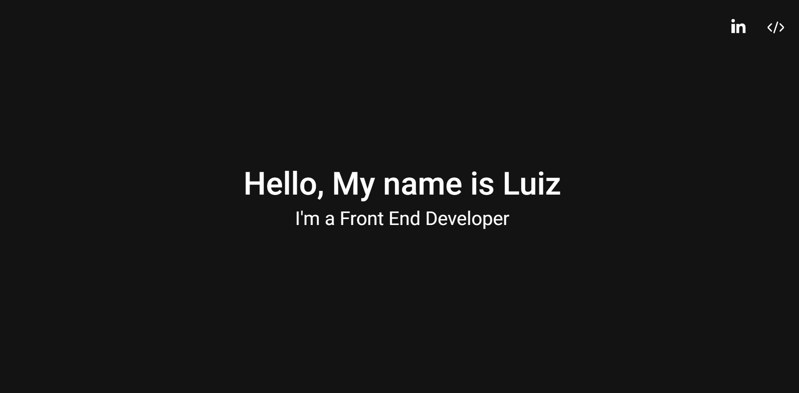

# Portfolio - Luiz

<br/>

<p align="center">
  
  
</p>

## Overview

---

This is a simple portfolio page, which is going to be updated over time to store my last projects and skills 


## How to setup

---

first clone or download the repository

```
git clone https://github.com/ssluizf/Portfolio.git
```

After that you can install the dependencies by executing the following command in the root folder of the project

```
npm install
```

or with yarn

```
yarn
```

**Development Mode**

Run the following script to start the aplicattion on development mode

```
npm run dev
```

or with yarn

```
yarn dev
```
